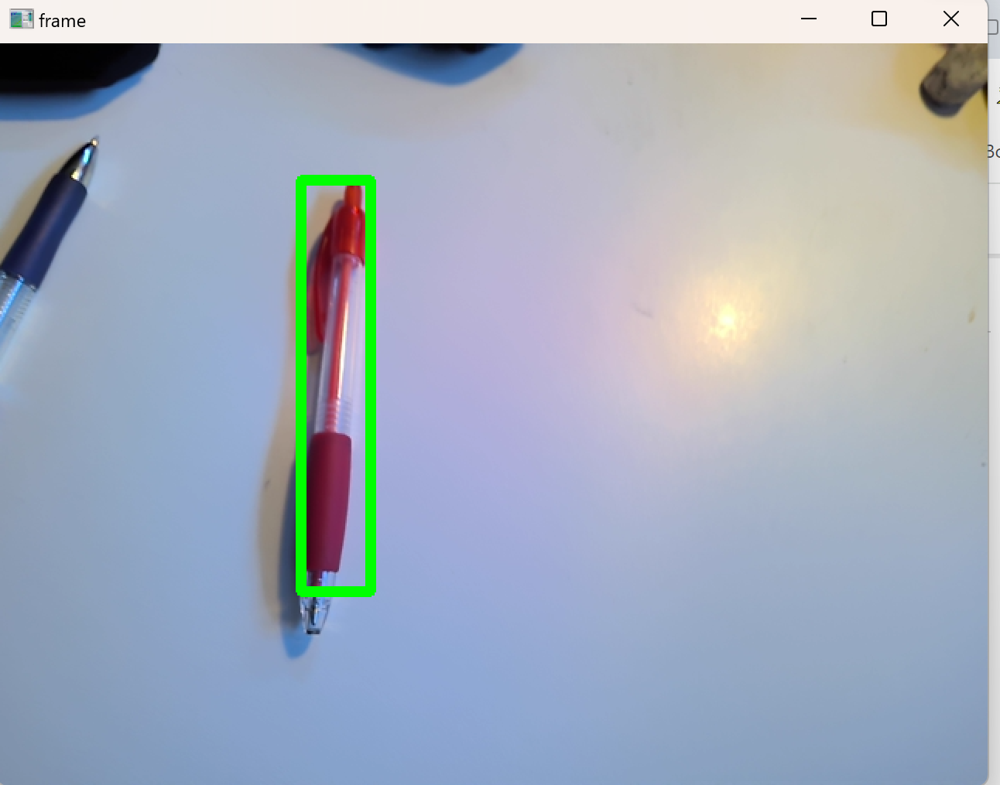

# Color-Detector

References
https://github.com/ChristophRahn/red-circle-detection/blob/master/red-circle-detection.py

https://www.youtube.com/watch?v=aFNDh5k3SjU

https://cvexplained.wordpress.com/2020/04/28/color-detection-hsv/#:~:text=The%20HSV%20values%20for%20true,10%20and%20160%20to%20180.

https://www.quora.com/What-are-the-advantages-of-Gaussian-blur-median-blur-and-the-bilateral-filter

https://medium.com/@sardorabdirayimov/colors-detection-using-masks-contours-in-opencv-72d127f0797e

https://answers.opencv.org/question/204175/how-to-get-boundry-and-center-information-of-a-mask/

Initial implementation

New implementation with HSV colour space

New implementation with recommended HSV colour range

New implementation with LAB color range

